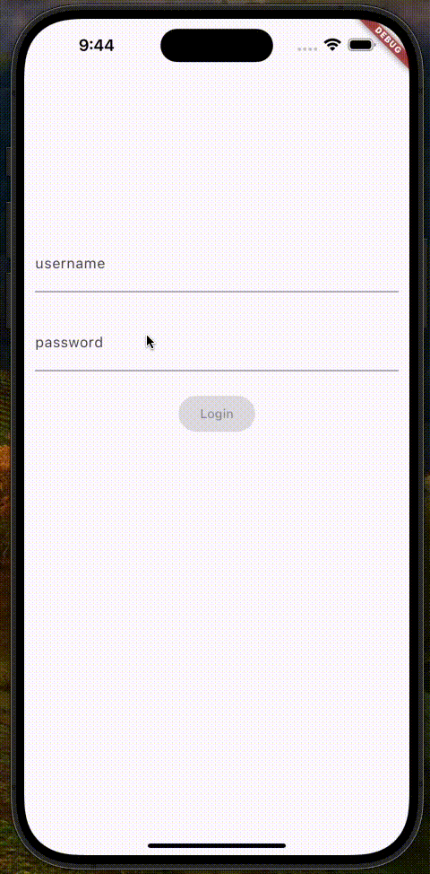

# Flutter Login Bloc

In the following tutorial, we're going to build a Login Flow in Flutter using the Bloc library.

## Key Topics

- BlocProvider, Flutter widget which provides a bloc to its children.
- BlocBuilder, Flutter widget that handles building the widget in response to new states.
- Using Cubit and Bloc. What's the difference?
- Adding events with context.read.⚡
- Prevent unnecessary rebuilds with Equatable.
- RepositoryProvider, a Flutter widget which provides a repository to its children.
- BlocListener, a Flutter widget which invokes the listener code in response to state changes in the bloc.
- Updating the UI based on a part of a bloc state with context.select.⚡

